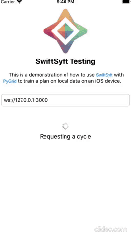

[](https://codecov.io/gh/OpenMined/SwiftSyft)


<!-- ALL-CONTRIBUTORS-BADGE:START - Do not remove or modify this section -->
[](#contributors-)
<!-- ALL-CONTRIBUTORS-BADGE:END -->

# SwiftSyft

SwiftSyft makes it easy for you to **train and inference PySyft models on iOS devices**. This allows you to utilize training data located directly on the device itself, bypassing the need to send a user's data to a central server. This is known as [federated learning](https://ai.googleblog.com/2017/04/federated-learning-collaborative.html).

- :gear: **Training and inference** of any PySyft model written in PyTorch or TensorFlow
- :bust_in_silhouette: Allows all data to stay on the user's device
- :back: Support for delegation to background task scheduler
- :key: Support for **JWT authentication** to protect models from Sybil attacks
- :+1: Host of **inbuilt best practices** to prevent apps from over using device resources.
  - :electric_plug: **Charge detection** to allow background training only when device is connected to charger
  - :zzz: **Sleep and wake detection** so that the app does not occupy resource when user starts using the device
  - :money_with_wings: **Wifi and metered network detection** to ensure the model updates do not use all the available data quota
  - :no_bell: All of these smart defaults are easily are **overridable**
- :mortar_board: Support for both reactive and callback patterns so you have your freedom of choice (\_in progress*)
- :lock: Support for **secure multi-party computation** and **secure aggregation** protocols using **peer-to-peer WebRTC** connections (_in progress_).

There are a variety of additional privacy-preserving protections that may be applied, including [differential privacy](https://towardsdatascience.com/understanding-differential-privacy-85ce191e198a), [muliti-party computation](https://www.inpher.io/technology/what-is-secure-multiparty-computation), and [secure aggregation](https://research.google/pubs/pub45808/).

[OpenMined](https://openmined.org) set out to build the **world's first open-source ecosystem for federated learning on web and mobile**. SwiftSyft is a part of this ecosystem, responsible for bringing secure federated learning to iOS devices. You may also train models on Android devices using [KotlinSyft](https://github.com/OpenMined/KotlinSyft) or in web browsers using [syft.js](https://github.com/OpenMined/syft.js).

If you want to know how scalable federated systems are built, [Towards Federated Learning at Scale](https://arxiv.org/pdf/1902.01046.pdf) is a fantastic introduction!

## Installation

### Cocoapods

Cocoapods is a dependency manager for Cocoa projects. Just add `OpenMinedSwiftSyft` to your Podfile like below:

```
pod 'OpenMinedSwiftSyft', ~> 0.1.3-beta1
```
## Quick Start

As a developer, there are few steps to building your own secure federated learning system upon the OpenMined infrastructure:

1. :robot: Generate your secure ML model using [PySyft](https://github.com/OpenMined/PySyft). By design, PySyft is built upon PyTorch and TensorFlow so you **don't need to learn a new ML framework**. You will also need to write a training plan (training code the worker runs) and an averaging plan (code that PyGrid runs to average the model diff).
2. :earth_americas: Host your model and plans on [PyGrid](https://github.com/OpenMined/PyGrid) which will deal with all the federated learning components of your pipeline. You will need to set up a PyGrid server somewhere, please see their installation instructions on how to do this.
3. :tada: Start training on the device!

**:notebook: The entire workflow and process is described in greater detail in our [project roadmap](https://github.com/OpenMined/Roadmap/blob/master/federated_learning/projects/model_centric_fl.md).**

You can use SwiftSyft as a front-end or as a background service. The following is a quick start example usage:

```swift

// This is a demonstration of how to use SwiftSyft with PyGrid to train a plan on local data on an iOS device

// Authentication token
let authToken = /* Get auth token from somewhere (if auth is required): */

// Create a client with a PyGrid server URL
if let syftClient = SyftClient(url: URL(string: "ws://127.0.0.1:5000")!, authToken: authToken) {

  // Store the client as a property so it doesn't get deallocated during training.
  self.syftClient = syftClient

  // Create a new federated learning job with the model name and version
  self.syftJob = syftClient.newJob(modelName: "mnist", version: "1.0.0")

  // This function is called when SwiftSyft has downloaded the plans and model parameters from PyGrid
  // You are ready to train your model on your data
  // modelParams - Contains the tensor parameters of your model. Update these tensors during training
  // and generate the diff at the end of your training run.
  // plans - contains all the torchscript plans to be executed on your data.
  // clientConfig - contains the configuration for the training cycle (batchSize, learning rate) and metadata for the model (name, version)
  // modelReport - Used as a completion block and reports the diffs to PyGrid.
  self.syftJob?.onReady(execute: { modelParams, plans, clientConfig, modelReport in

    // This returns an array for each MNIST image and the corresponding label as PyTorch tensor
    // It divides the training data and the label by batches
    guard let MNISTDataAndLabelTensors = try? MNISTLoader.loadAsTensors(setType: .train) else {
        return
    }

    // This loads the MNIST tensor into a dataloader to use for iterating during training
    let dataLoader = MultiTensorDataLoader(dataset: MNISTDataAndLabelTensors, shuffle: true, batchSize: 64)

    // Iterate through each batch of MNIST data and label
    for batchedTensors in dataLoader {

      // We need to create an autorelease pool to release the training data from memory after each loop
      autoreleasepool {

          // Preprocess MNIST data by flattening all of the MNIST batch data as a single array
          let MNISTTensors = batchedTensors[0].reshape([-1, 784])

          // Preprocess the label ( 0 to 9 ) by creating one-hot features and then flattening the entire thing
          let labels = batchedTensors[1]

          // Add batch_size, learning_rate and model_params as tensors
          let batchSize = [UInt32(clientConfig.batchSize)]
          let learningRate = [clientConfig.learningRate]

          guard
              let batchSizeTensor = TorchTensor.new(array: batchSize, size: [1]),
              let learningRateTensor = TorchTensor.new(array: learningRate, size: [1]) ,
              let modelParamTensors = modelParams.paramTensorsForTraining else
          {
              return
          }

          // Execute the torchscript plan with the training data, validation data, batch size, learning rate and model params
          let result = plans["training_plan"]?.forward([TorchIValue.new(with: MNISTTensors),
                                                        TorchIValue.new(with: labels),
                                                        TorchIValue.new(with: batchSizeTensor),
                                                        TorchIValue.new(with: learningRateTensor),
                                                        TorchIValue.new(withTensorList: modelParamTensors)])

          // Example returns a list of tensors in the folowing order: loss, accuracy, model param 1,
          // model param 2, model param 3, model param 4
          guard let tensorResults = result?.tupleToTensorList() else {
              return
          }

          let lossTensor = tensorResults[0]
          lossTensor.print()
          let loss = lossTensor.item()

          let accuracyTensor = tensorResults[1]
          accuracyTensor.print()

          // Get updated param tensors and update them in param tensors holder
          let param1 = tensorResults[2]
          let param2 = tensorResults[3]
          let param3 = tensorResults[4]
          let param4 = tensorResults[5]

          modelParams.paramTensorsForTraining = [param1, param2, param3, param4]

      }
    }

        // Generate diff data and report the final diffs as
        let diffStateData = try plan.generateDiffData()
        modelReport(diffStateData)

  })

  // This is the error handler for any job exeuction errors like connecting to PyGrid
  self.syftJob?.onError(execute: { error in
    print(error)
  })

  // This is the error handler for being rejected in a cycle. You can retry again
  // after the suggested timeout.
  self.syftJob?.onRejected(execute: { timeout in
      if let timeout = timeout {
          // Retry again after timeout
          print(timeout)
      }
  })

  // Start the job. You can set that the job should only execute if the device is being charge and there is
  // a WiFi connection. These options are on by default if you don't specify them.
  self.syftJob?.start(chargeDetection: true, wifiDetection: true)
}
```

### API Documenation

See [API Documenation](Documentation/Reference/README.md) for complete reference.

### Running in the background

A mini tutorial on how to run `SwiftSyft` on iOS using the background task scheduler can be found [here](Background-Example.md)

### Running the Demo App

The demo app fetches the plans, protocols and model weights from PyGrid server hosted locally. The plans are then deserialized and executed using libtorch.

<p align="center">

</p>

Follow these steps to setup an environment to run the demo app:

- Clone the repo [PyGrid](https://github.com/OpenMined/PyGrid) and change directory to `PyGrid/apps/domain`

```bash
$ git clone https://github.com/OpenMined/PyGrid
$ cd PyGrid/apps/domain
```
- Run the PyGrid Domain application

```bash
$ ./run.sh --port 5000 --start_local_db
```

- Install [PySyft](https://github.com/OpenMined/PySyft) from source or via PyPy. Follow the instructions specified in the repo.
- Clone the `PySyft` repo. In your command line, go to `PySyft/examples/federated-learning/model-centric/` folder and run jupyter notebook.

```bash
$ cd PySyft/examples/federated-learning/model-centric/
$ jupyter notebook
```
- Open the notebook `mcfl_create_plan_mobile.ipynb` notebook. Run all the cells to host a plan to your running PyGrid domain server.

- Set-up demo project using Cocoapods
- Install [Cocoapods](https://cocoapods.org/)

```bash
gem install cocoapods
```

- Install the dependencies of the project.

```bash
pod install # On the root directory of this project
```

- Open the file `SwiftSyft.xcworkspace` in Xcode.
- Run the `SwiftSyft` project. It automatically uses `127.0.0.1:5000` as the PyGrid URL.

## Contributing

### Set-up

You can work on the project by running `pod install` in the root directory. Then open the file `SwiftSyft.xcworkspace` in Xcode. When the project is open on Xcode, you can work on the `SwiftSyft` pod itself in `Pods/Development Pods/SwiftSyft/Classes/*`

### Workflow

1. Star, for and clone the repo
2. Open the project in Xcode
3. Check out current issues and Github. For newcomers, check out issues labeled `Good first issue`
4. Do your work
5. Push your fork
6. Submit a PR to OpenMined/SwiftSyft

Read the [contribution guide](https://github.com/OpenMined/.github/blob/master/CONTRIBUTING.md) as a good starting place.

### Support

For support in using this library, please join the **#lib_swift_syft** Slack channel. If you'd like to follow along with any code changes to the library, please join **#code_swiftsyft** Slack channel. [Click here to join our Slack Community!](https://slack.openmined.org)

## License

[Apache License 2.0](https://choosealicense.com/licenses/apache-2.0/)

## Contributors ✨

Thanks goes to these wonderful people ([emoji key](https://allcontributors.org/docs/en/emoji-key)):

<!-- ALL-CONTRIBUTORS-LIST:START - Do not remove or modify this section -->
<!-- prettier-ignore-start -->
<!-- markdownlint-disable -->
<table>
  <tr>
    <td align="center"><a href="https://github.com/mjjimenez"><br /><sub><b>Mark Jimenez</b></sub></a><br /><a href="https://github.com/OpenMined/SwiftSyft/commits?author=mjjimenez" title="Code">💻</a> <a href="https://github.com/OpenMined/SwiftSyft/commits?author=mjjimenez" title="Documentation">📖</a></td>
    <td align="center"><a href="https://github.com/mamuleanu"><br /><sub><b>Madalin Mamuleanu</b></sub></a><br /><a href="https://github.com/OpenMined/SwiftSyft/commits?author=mamuleanu" title="Code">💻</a></td>
    <td align="center"><a href="https://rohith-hacker.github.io/"><br /><sub><b>Rohith Pudari</b></sub></a><br /><a href="https://github.com/OpenMined/SwiftSyft/commits?author=Rohith-hacker" title="Code">💻</a></td>
    <td align="center"><a href="https://github.com/Baschdl"><br /><sub><b>Sebastian Bischoff</b></sub></a><br /><a href="https://github.com/OpenMined/SwiftSyft/commits?author=Baschdl" title="Documentation">📖</a></td>
    <td align="center"><a href="http://lukereichold.com"><br /><sub><b>Luke Reichold</b></sub></a><br /><a href="https://github.com/OpenMined/SwiftSyft/commits?author=lukereichold" title="Code">💻</a></td>
  </tr>
</table>

<!-- markdownlint-enable -->
<!-- prettier-ignore-end -->
<!-- ALL-CONTRIBUTORS-LIST:END -->

This project follows the [all-contributors](https://github.com/all-contributors/all-contributors) specification. Contributions of any kind welcome!
